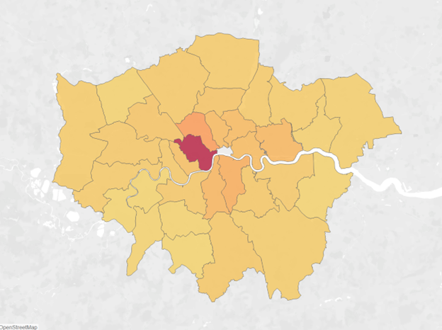
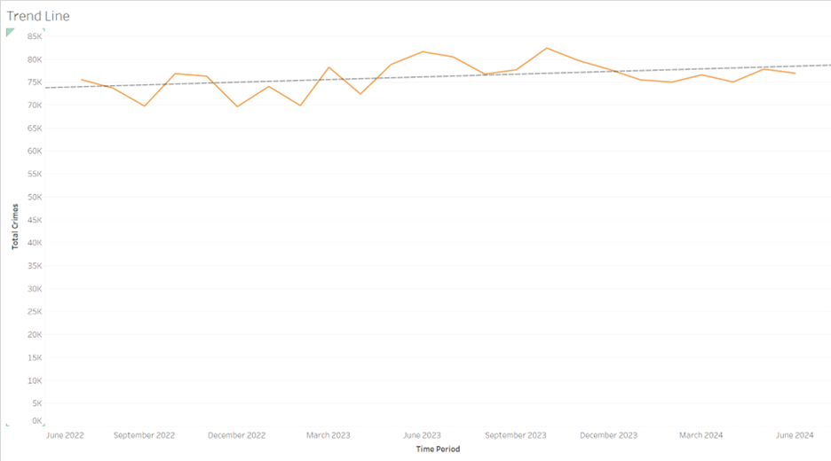
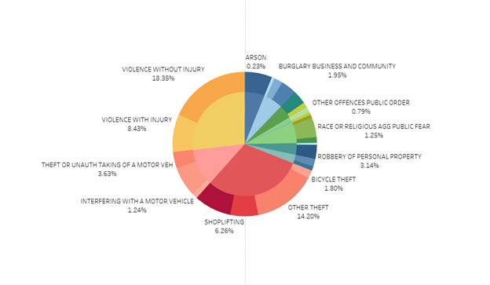
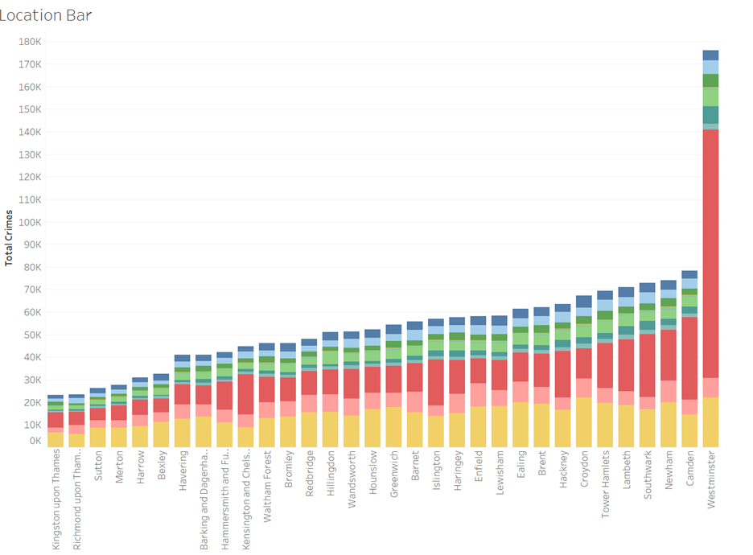

# London Crime Data Visualization

---


## Project Overview
Analyze and visualize crime data for London boroughs, focusing on Barking and Dagenham from **July 2022** to **June 2024**. The goal is to uncover temporal trends, geographic hotspots, and borough-level comparisons to support data-driven policy making.

## Datasets
1. **Recorded Crime Summary**  
   - **Source:** Greater London Authority  
   - **URL:** https://data.london.gov.uk/dataset/recorded_crime_summary  
   - **Description:** Monthly counts of recorded crimes in London, categorized by crime type and borough.

2. **Statistical GIS Boundary Data**  
   - **Source:** Ordnance Survey  
   - **URL:** https://www.data.gov.uk/dataset/statistical-gis-boundary-files-for-london  
   - **Description:** Geographic boundaries, coordinates, and area data for each London borough.

## Data Preparation
1. **Cleaning & Merging**  
   - Removed null values and corrected typos in Excel.  
   - Merged crime and GIS datasets on `Borough Name`.  
2. **Transformation in Tableau**  
   - Pivoted monthly columns (wide → long format) into `Date` and `Crime Count` fields.  
   - Created parameters for `Start Date` and `End Date` with a calculated field for dynamic crime sums.

### Choropleth Map
This map shows crime intensity across London boroughs, with darker shades indicating higher crime counts




### Crime Trend Line Chart
Month-by-month crime counts from July 2022 to June 2024, complete with trendlines and hover details.




### Crime Type Pie Chart
Proportion of major crime categories (Theft, Violent Crime, etc.) across the entire period.




### Borough Comparison Bar Graph
Ranking of boroughs by total crime counts to highlight the highest and lowest crime areas.




### Key Findings
1. Hotspot Identification: Westminster has the highest crime intensity, driven largely by theft.
2. Temporal Trends: Overall crime shows a slight upward trend, while burglary and weapons offences have declined.
3. Spatial Variations: Significant disparities between boroughs suggest focusing resources on high-crime areas.


## Usage
1. **Clone the repository**  
   ```bash
   git clone https://github.com/yourusername/london-crime-visualization.git


## Future Work

- Add finer-grained spatial data (e.g., LSOA level).
- Overlay socio-economic and demographic layers.
- Incorporate predictive modeling (e.g., time-series forecasting).

## References

- [Greater London Authority. Recorded Crime Summary](https://data.london.gov.uk/dataset/recorded_crime_summary)
- [Ordnance Survey. Statistical GIS Boundary Files for London](https://www.data.gov.uk/dataset/statistical-gis-boundary-files-for-london)
- [Tableau Software. Business Intelligence and Data Visualization Software](https://www.tableau.com)

